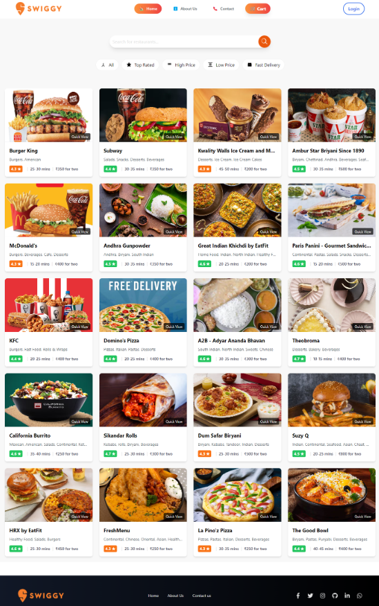

<!-- Title and Description -->
<h1 align="center">
  SwiftyEats
   
</h1>

A modern and responsive food delivery platform built with React.

<!-- Screenshots -->
<h2 align="center">Screenshots</h2>

  

<!-- Description and Features -->
<h2 align="center">Description</h2>

  SwiftyEats is a web application built with React and Parcel that mimics the Swiggy food delivery platform. It allows users to browse restaurants, view menus, add items to the cart, and place orders.

<h2 align="center">Features</h2>

  <ul>
    <li>🍔 Browse a list of restaurants</li>
    <li>📜 View restaurant details and menus</li>
    <li>🛒 Add items to the cart</li>
    <li>🚀 Simulate order placement</li>
  </ul>

<!-- Technologies Used -->
<h2 align="center">Technologies Used</h2>

  React, Parcel

<!-- Installation Instructions -->
<h2 align="center">Installation</h2>

  To run SwiftyEats locally, follow these steps:

  <ol>
    <li>Clone the repository:
      <pre><code>https://github.com/yacinova/SwiftyEats-Restaurant.git</code></pre>
    </li>
    <li>Navigate to the project directory:
      <pre><code>cd SwiftyEats</code></pre>
    </li>
    <li>Install dependencies:
      <pre><code>npm install</code></pre>
    </li>
    <li>Start the development server:
      <pre><code>npm start</code></pre>
    </li>
    <li>Open <code>http://localhost:1234</code> in your preferred browser.</li>
  </ol>

---

Made with ❤️ by YASSINE HAMDOUNE

  Contact: <a href="mailto:hamdouneyassine.03@gmail.com">hamdouneyassine.03@gmail.com</a>

